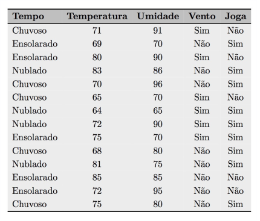

# Mineração de Dados

A etapa de Mineração de Dados engloba a preparação, a análise estatística e o pré-peocessamento dos dados. Alguns estudos apontam que essas etapas juntas representam 60% de todo o tempo gasto até a indução dos modelos de AM. Outros estudos também  apontam que um pré-processamento adequado é fundamental para a indução dos algoritmos de AM de forma eficiente. As seções seguintes irão abordar essas etapas.   
   
## Preparação e Análise dos Dados

A preparação e análise dos dados é uma etapa fundamental da tarefa de AM. Ela permite que informações valiosas como a descoberta de padrões e tendências nos padrões que geraram os dados. Algumas podem ser obtidas por meio de fórmulas estatísticas e outras por meio de técnicas de visualização dos dados.

### Conjuntos de Dados

Um conjunto de dados são formados por **amostras** ou **objetos** físicos ou abstratos. Cada objeto é descrito por um conjunto de **atributo de entrada** ou  **atributo preditivo** ou **vetor e característica**. Cada objeto corresponde a uma ocorrência desses dados. Cada atributo esta relacionado a uma propriedade do objeto. Em bases supervisonadas, o conjunto de dados tem um atributo especial chamado de **atributo de saída** ou **rótulo**. Esse atributo de saída pode ser contínuo ou discreto. Quando contínuo dizemos que esse conjunto de dados é de regressão e quando discreto, de classificação.

Formalmente esse conjunto de dados é representado por uma matriz  onde *n* é o número de objetos e *d* é o número de atributos de entrada. Os rótulos são um vetor  onde  representa os *l* atributos de saída da base de dados. Cada elemento dessa matriz  contém o valor da j-ésima característica para o i-ésimo objeto. Também podemos representar os *d* atributos como eixos ortogonais, os objetos como pontos no espaço de dimensão *d* e os rótulos como formato ou cor desses pontos.  

Apesar do crescente número de bases disponíveis, na maioria das vezes não é possível aplicar os algoritmos de AM de forma direta. Portanto uma etapa anterior de análise dos dados e outra de pré-processamento são fundamentais. Enquanto a análise permite entender os dados que serão tratados, a etapa de pré-processamento permite a integração dos dados de diferentes fontes em estrutura em forma de matriz, a eliminação de atributos irrelevantes que não represetam informações relacionadas ao contexto, o balanceamento das amostras para tornar a base mais uniforme, a presença de ruído, dados incosistêntes e a transformação são outros problemas. 

### Análise dos Dados

O conjunto de dados *Jogar Tênis* é um problema de classificação aonde pretende-se classificar se uma pessoa deve ou não, dado certas condições climáticas, jogar tênis. Nessa base de dados,  o valor *n* é 14 e o valor de *d* é 4. Como é uma supervisionada com rótulos discretos, ela apresenta um rótulos são um vetor  com *l* igual a 2. Cada linha representa uma amostra/dado/objeto e cada coluna/variável/atributo uma característica relacionada a essa amostra. Os atributos de entrada são o *Tempo*, *Temperatura*, *Umidade* e *Vento*. A última coluna denominada *Joga* representa os rótulos jogar ou não tênis.

 *Base de dados Jogar Tênis. Adaptado de Katti Faceli et al., (2011)*

Os valores que os atributos podem assumir são definidos de diferentes formas. Uma delas é usar a definição de tipo e escala. Enquanto o tipo do atributo diz respeito ao grau de quantização nos dados, a escala indica a significância relativa dos valores. O tipo pode ser quantitativo/numérico e qualitativo/simbólico/categórico e a escala pode ser nominais, ordinais, intervalares e racionais. 

Os valores quantitativos/numéricos podem ser contínuos ou discretos mas frequentemente representados por valores reais e apresentam alguma medida associada. Os atributos qualitativos/simbólicos/categóricos apresentam um número finito de categorias. Alguns atributos qualitativos podem apresentar ordem mas esse caso específico é muitas vezes desencorajado nas bibliotecas de AM. Além disso, esse tipo de dado não aceita operações aritméticas.  

A escala define as operações que podem ser realizadas sobre os valores dos atributos. Enquanto a escala nominal e ordinal são do tipo qualitativo, a escala intervalar e racional é do tipo quantitativo. A escala nominal é presentada por nomes diferentes. As operações permitidas são de igualdade e diferença. Os valores ordinais, além das operações de igualdade e diferença, também apresentam ordem. Nesse caso podemos verificar se um determinando categoria é maior/superior, menor/inferior ou igual. A ecala intervar são números que variam dentro de um intervalo. Nesse caso é possível diferenciar a ordem e a diferença entre dois valores. Os atributos com escala racional são os mais informativos. Nesse caso existe um zero absoluto junto com uma unidade de medida de forma que a razão tenha significado.  

Dessa forma podemos classificar os atributos da base de dados *Jogar Tênis* da seguinte forma:

* Tempo: Qualitativo nominal porque apresenta as categorias chuvoso, ensolarado e nublado que não apresentam ordem. 
* Temperatura: Quantitativo intervar porque apresenta valores numéricos de temperatura na escala Fahrenheit 
* Umidade: Quantitativo racional porque apresenta valores numéricos de temperatura na escala de porcentagem, ou seja, temos um zero absoluto.
* Vento: Qualitativo nominal porque apresenta as categorias sim e não que não apresentam ordem. 

### Estatística Descritiva

A estatística descritiva resume de forma quantitativa as principais características de um conjunto de dados. Elas assumem que os dados foram gerados por algum processo estocástico. Ou seja, se os dados respeitam uma distribuição normal com média zero e variância 1, essas medidas podem facilmente capturar essa informação. Essas medidas ainda podem ser univariadas ou multivariadas.

#### Univariadas

* Medidas de localidade: média, mediana, intervalo, desvio padrão, variância, etc.
* Medidas de distribuição: momento, obluiquidade, curtose, etc.

#### Multivariadas

* convariância
* correlação

## Pré-processamento dos Dados

### Limpeza dos Dados

#### Incompletos

#### Redudantes

#### Desbalanceamento

#### Ruídos

### Transformação dos Dados

### Redução de Dimensionalidade

