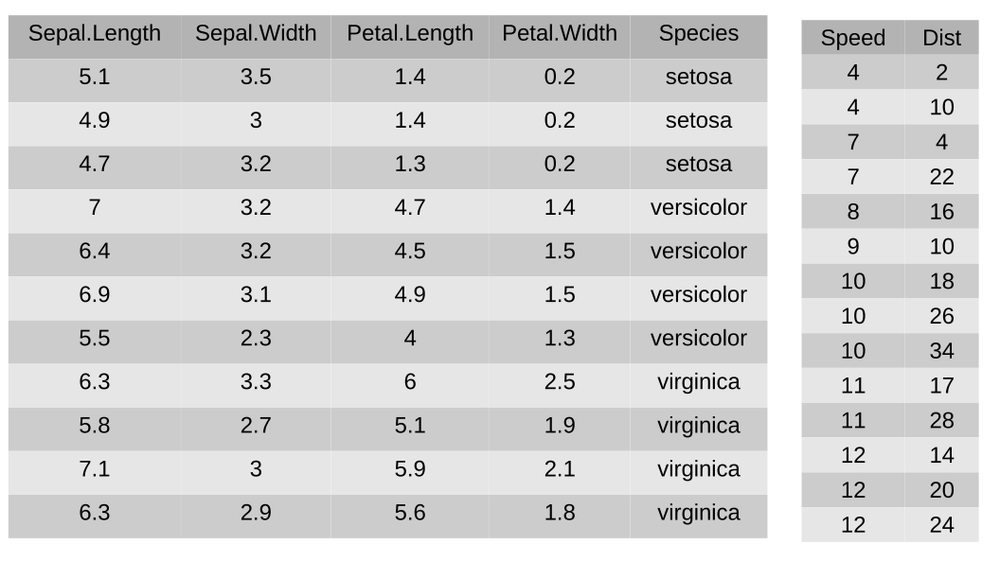
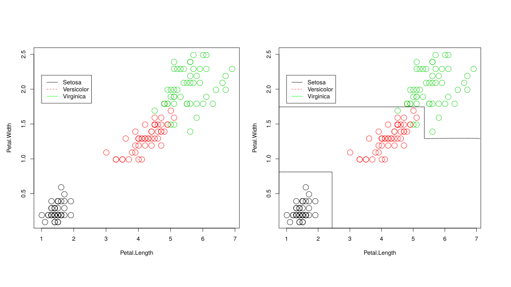
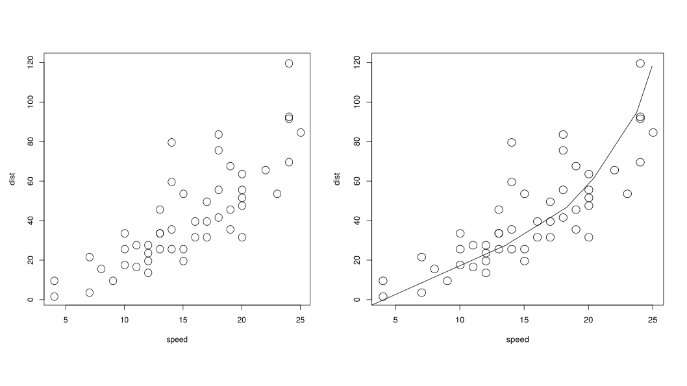

 # Aprendizado de Máquina

Aprendizado de Máquina (AM) pode ser definido formalmente como uma função  que aproxima  capaz de construir um estimador dado um conjunto de dados   . Portanto, podemos dizer que . É importante ressaltar que  é uma função desconhecida e que  permite estimar .

Formalmente um problema supervisionado pode ser representado por um conjunto  em que  é uma matriz representando os atributos preditivos e  é um vetor representando o atributo alvo. Quando o problema é de [classificação](class), ou seja, os rótulos são valores nominais, temos  onde  representa os *l* atributos de saída da base de dados. Quando o problema é de [regressão],(regr) ou seja, os rótulos são valores reais infinitos e ordenados, temos . Enquanto nos problemas de classificação  nos problemas de regressão temos 

O viés de busca e representação da técnica de AM define como  será encotrada. Além disso, ela pode ser representada por regras, expressões lógicas, polinômios e etc. Portanto, diferentes algoritmos de AM irão encontrar diferentes fronteiras. Além disso, diferenças nos conjuntos de dados de treinamento, variações na ordem de apresentação, diferentes valores de parâmetros das técnicas e processos internos estocásticos podem fazer com que um mesmo algoritmo de AM encontre fronteiras diferentes.

As duas Tabelas a seguir mostram bases de dados supervisonadas de clssificação e regressão. A Tabela da esquerda mostra um subconjunto de amostras da base de dados *iris*. Essa base é composta por 4 atributos preditivos numéricos relacionados as características das flores dessa espécie e 150 amostras. A base é multiclasse por apresentar 3 classes: *setosa*, *virgínica* e versicolor* e balanceada, pois apresenta 50 amostras por classe. A Tabela da esquerda mostra um subconjunto de amostras da base de dados *cars*.  Essa base é composta por um atributo alvo numérico que reprensenta a velocidade de um carro e um atributo preditovo numérico relacionado a distância que um determinado carro percorre até parar completamentamente depois que os freios foram acionados. Além disso, a base tem 50 amostras.

 *Tabela da base de dados Iris e Cars.*

A Figura a seguir é o gráfico de dispersão da base de dados *Iris*. Apesar da base *Iris* apresentar 4 atributos, nesse gráfico foram selecionados os dois atributos mais informativos da base: o tamanho e largura da pétala. Também é apresentado uma função  induzida por algum algoritmo de AM. É importante perceber que enquanto a classe *setosa* é linearmente separável das outras, a classe *virgínica* e *versicolor* apresentam um fronteira de decisão não linear. Isso pode ser um inidicativo de que a fronteira de decisão entre essas classes deve ser mais complexa.  

 *Gráfico de dispersão da base de dados Iris e uma função f' qualquer.*

A Figura a seguir é o gráfico de dispersão da base de dados *Cars*. Também é apresentado uma função  induzida por algum algoritmo de AM. É importante ressaltar que essa função são combinações de retas que seguem o comportamento geral das amostras: quanto maior a distância necessária para a frenagem de um carro, maior deve ser sua velocidade. 

 *Gráfico de dispersão da base de dados Cars e uma função f' qualquer.*

